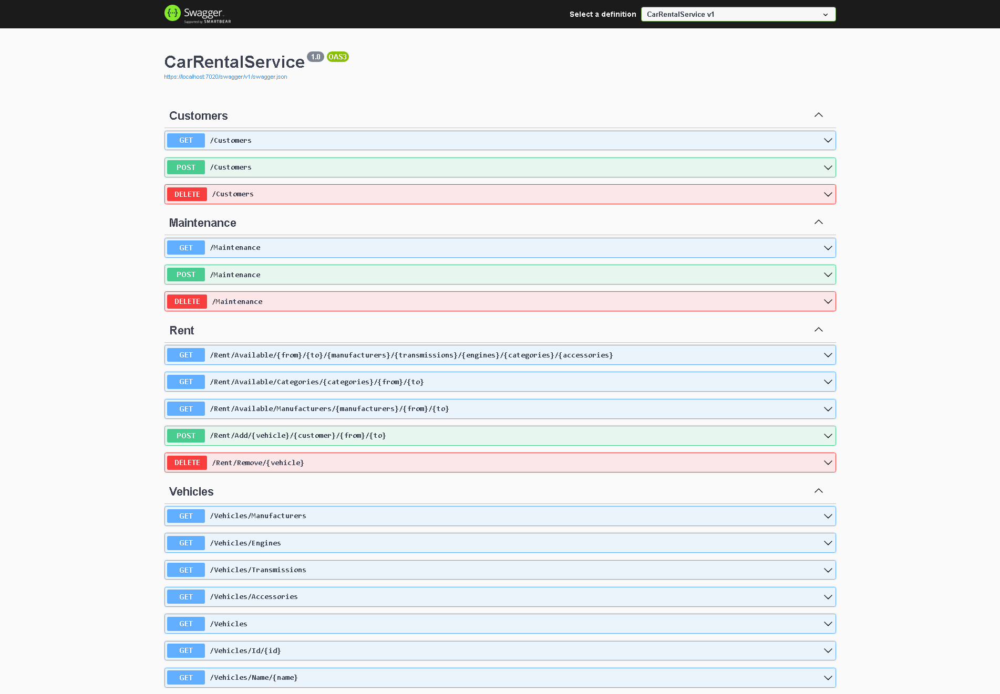

# Folder structure
This is the folder structure:
```
root
│   CarRentalModel.sln
│   CarRentalService.sln
│   ...
└───EFModel
│   │   EFModel.csproj
│   │   dbcreate.sql
│   │	...
└───EFModelTests
│   │   EFModelTests.csproj
│   │   ...
└───CarRentalService
│   │   CarRentalService.csproj
│   │   ...
```

`CarRentalModel.sln` contains the `EFModel` project, the Entity Framework project for the database management, and the related `EFModelTests` test project; the script `dbcreate.sql` creates the database from scratch and the basic data.

`CarRentalService.sln` contains the `CarRentalService` REST service project, and the `EFModel` from which the service depends on.


# API structure

